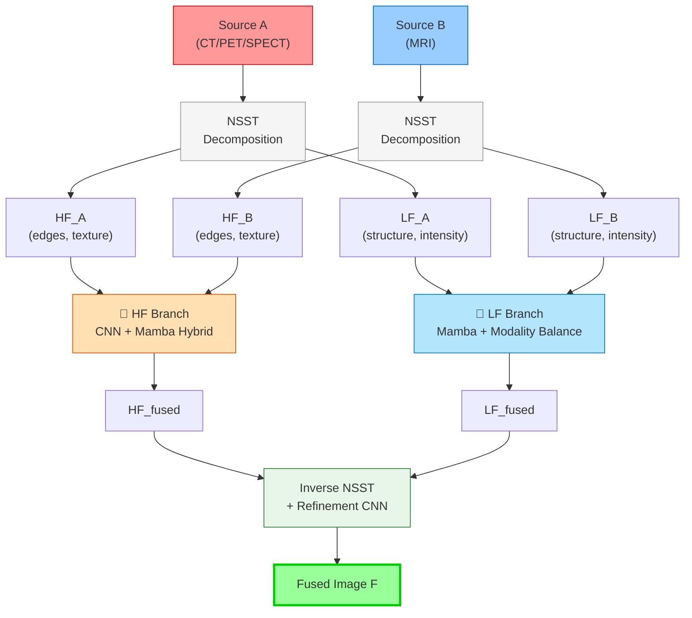
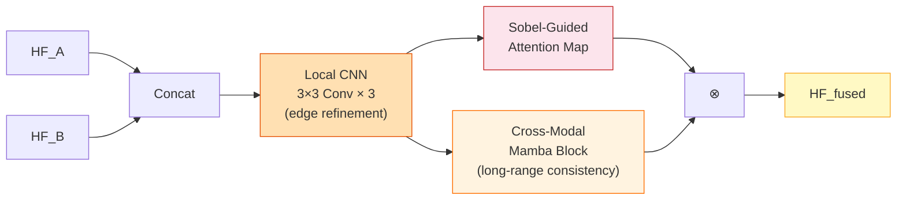
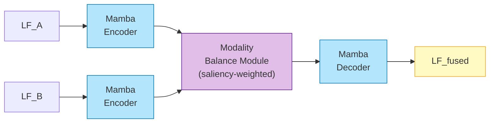
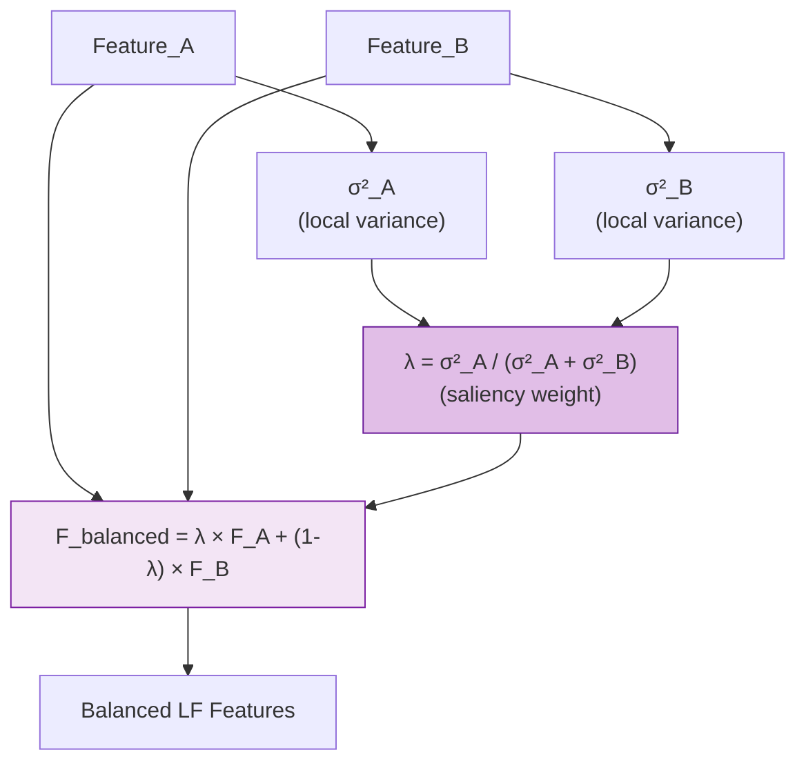
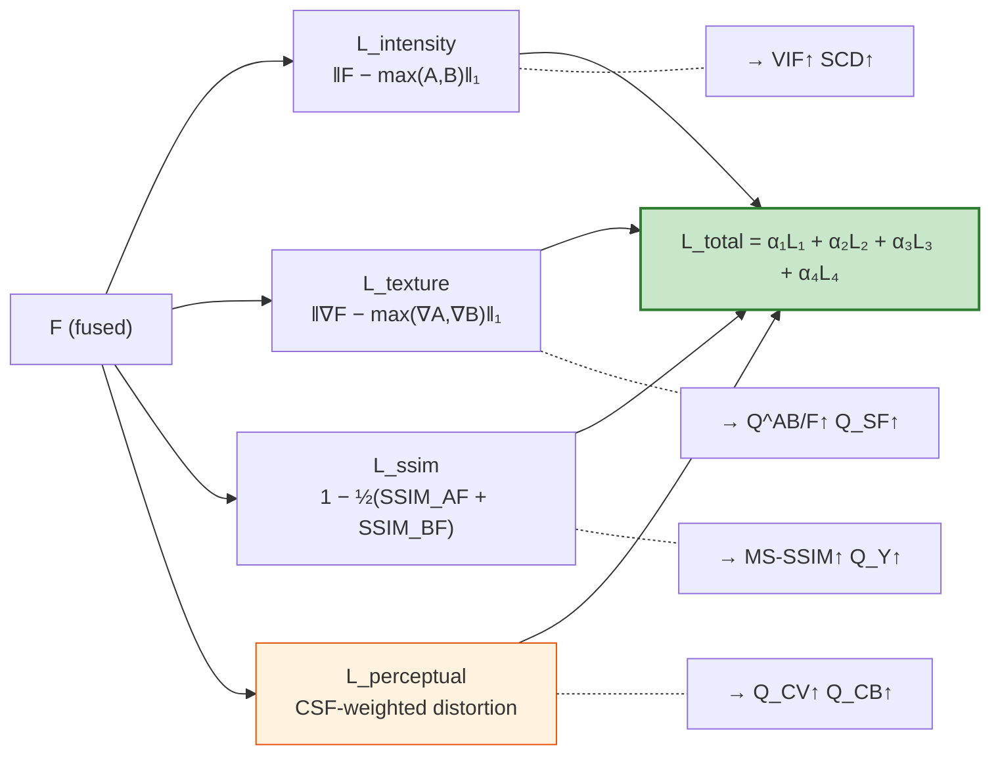
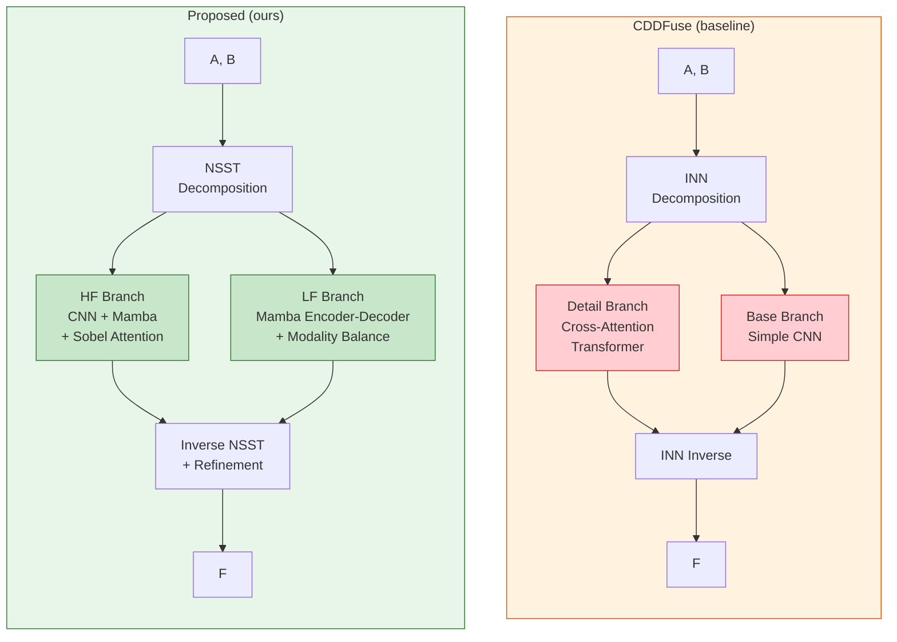

# Architecture Diagram — Frequency-Aware Dual-Branch Fusion

## Overview Architecture

## HF Branch Detail — CNN + Mamba Hybrid

## LF Branch Detail — Mamba + Modality Balance

## Modality Balance Module Detail

## Loss Function

## So sánh với CDDFuse (baseline)

